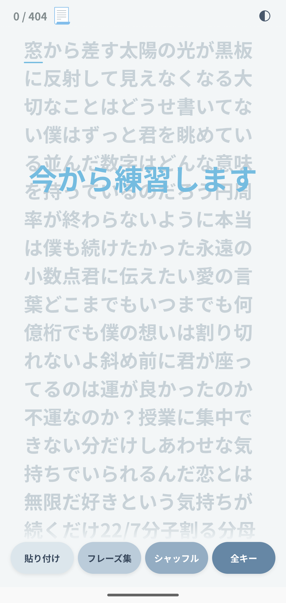
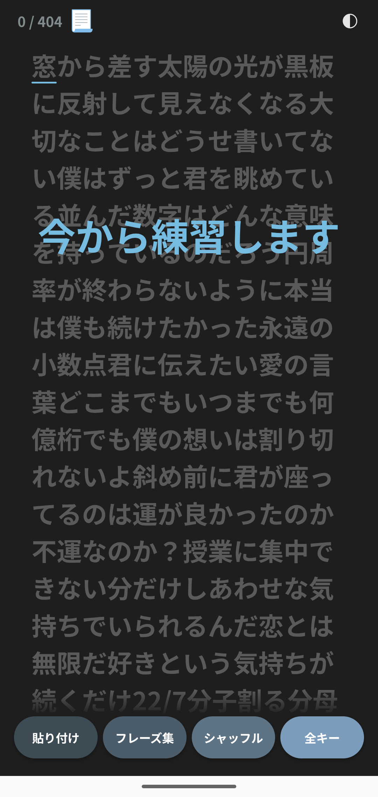
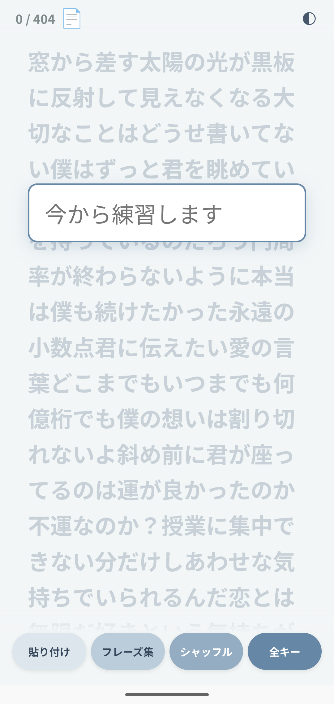
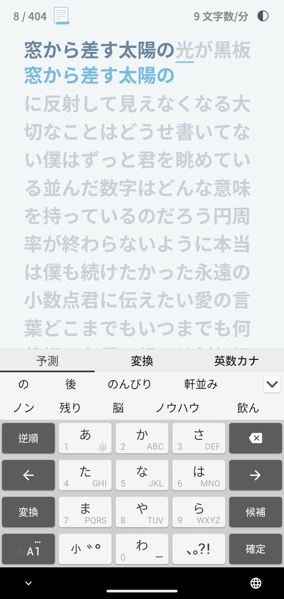
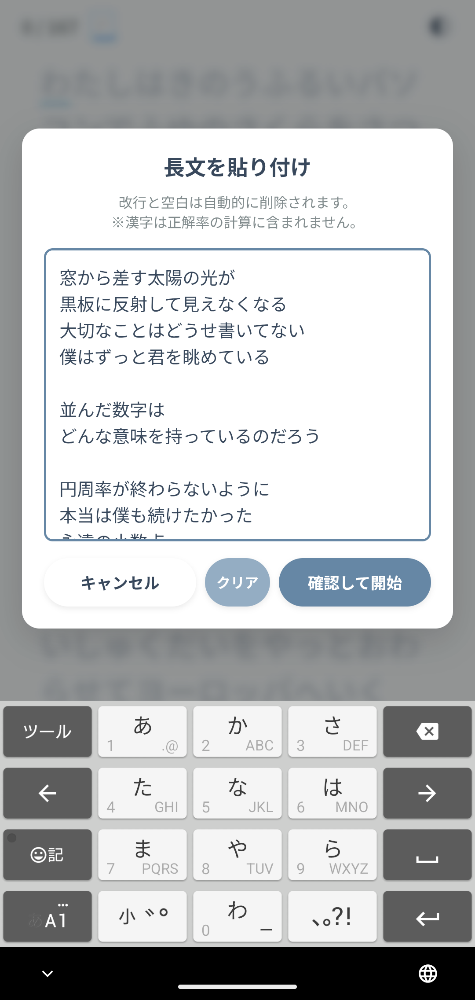
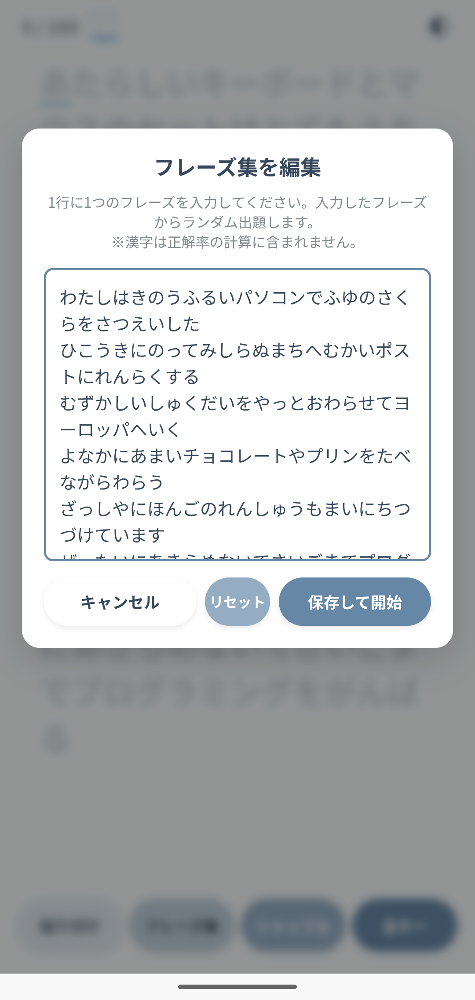
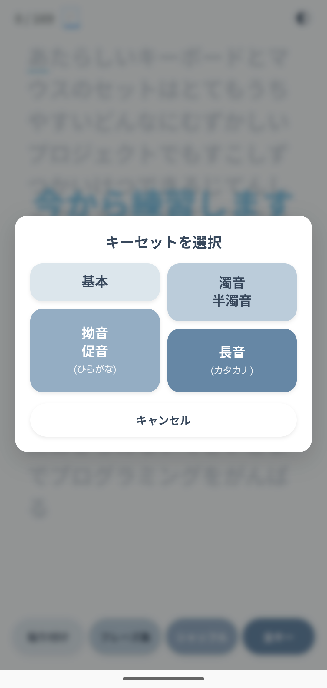
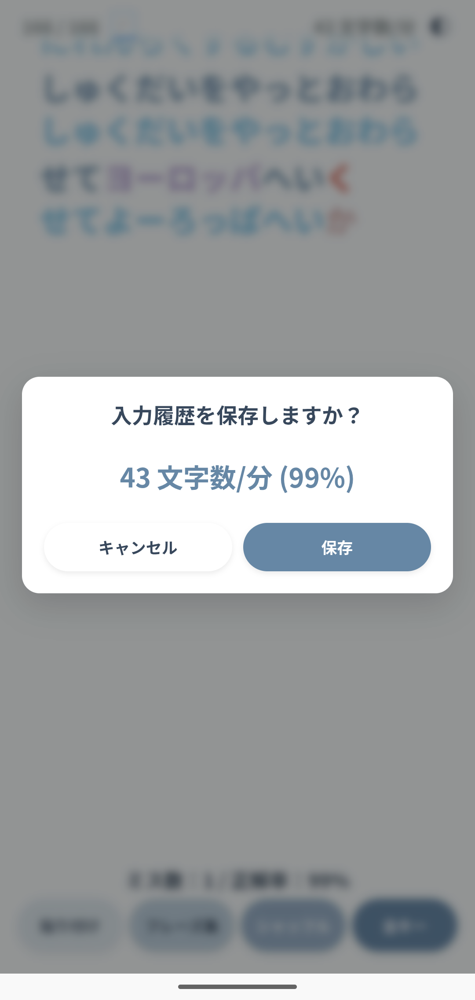
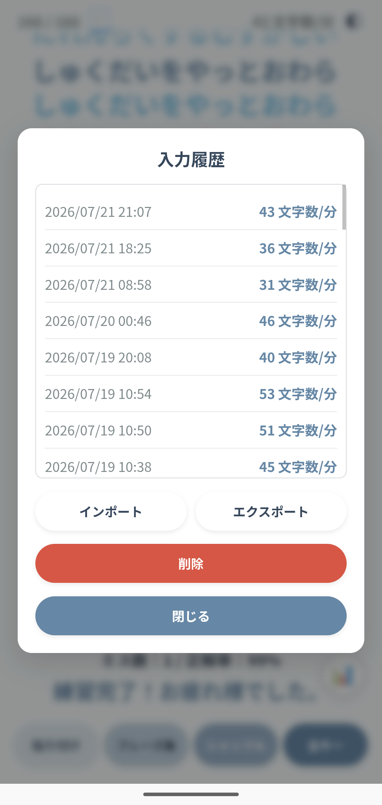

# かなフリック入力練習 (KanaType)

日本語のかな入力（フリック入力対応）を練習するためのPWA（Progressive Web App）です。
通常の入力画面に加え、LINE風のチャットUIで練習できるモードを搭載しています。

🔗 **公開ページ**: https://81d8d0.github.io/kana/

## 特徴

- **2つのUIモード**：通常の「標準モード」と、会話形式で練習できる「LINE風モード」を切り替え可能。
- **フレーズ集モード**：あらかじめ用意された短文の中からランダムに出題（フレーズは自分で編集・保存可能）。
- **貼り付けモード**：任意の文章を貼り付けて練習素材にできる。LINE風モードでは長文から約200文字を抜き出し、6つの会話に分けて出題。
- **シャッフル**：1タップで別の練習文に切り替え。
- **キーセットの選択**：基本／濁音・半濁音／拗音・促音（ひらがな）／長音（カタカナ）など、練習したい文字種を選んで出題。
- IMEの変換途中（コンポジション中）の状態を考慮した入力判定。
- ミスの記録・CPM（1分あたりの文字数）計測。
- 入力履歴の保存・インポート／エクスポート。
- ダークモード対応。
- ホーム画面に追加してアプリのように使える（PWA / Web App Manifest + Service Worker対応）。

## 使い方

1. https://81d8d0.github.io/kana/ にアクセス
2. ヘッダーのアイコンから「標準モード (📃/📄)」または「LINE風モード (💬)」を選択
3. 「フレーズ集」から練習文を選ぶ、または「貼り付け」で好きな文章を練習素材にする
4. 表示された文章の通りに入力していく
5. 完了すると正解率・CPMなどの結果が表示される

スマホでは「ホーム画面に追加」することで、アプリのように起動できる。

## スクリーンショット (標準モード)

<table width="100%">
<tr>
<td width="33.33%"></td>
<td width="33.33%"></td>
<td width="33.33%"></td>
</tr>
<tr>
<td width="33.33%"></td>
<td width="33.33%"></td>
<td width="33.33%"></td>
</tr>
<tr>
<td width="33.33%"></td>
<td width="33.33%"></td>
<td width="33.33%"></td>
</tr>
</table>

## ファイル構成

| ファイル | 役割 |
| --- | --- |
| `index.html` | アプリ本体（標準モード UI・ロジック） |
| `line.html` | アプリ本体（LINE風モード UI・ロジック） |
| `manifest.json` | PWAマニフェスト（標準モード・LINE風モード共通） |
| `sw.js` | Service Worker（オフライン対応・キャッシュ管理） |
| `icon.png` / `icon-192.png` / `mode.svg` / `mic.jpg` | アプリアイコン・UI用アイコン画像類 |

## 技術構成

- HTML / CSS / Vanilla JavaScriptのみで構築（フレームワーク不使用）
- PWA（Web App Manifest + Service Worker）
